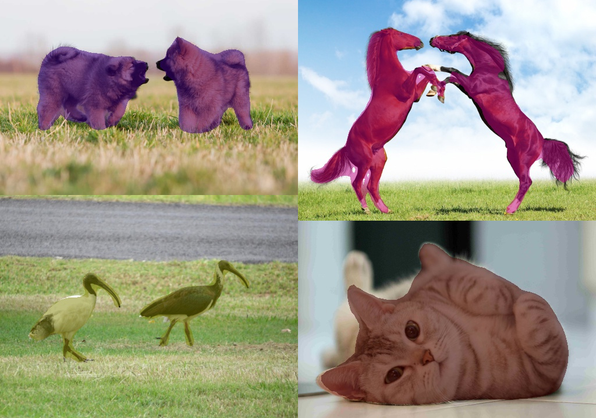

# FCN for Semantic Image Segmentation on TensorFlow

This is an implementation of Fully Convolutional Networks (FCN) achieving **68.5 mIoU** on PASCAL VOC2012 validation set. The model generates semantic masks for each object class in the image using a VGG16 backbone. It is based on the work by E. Shelhamer, J. Long and T. Darrell described in the [PAMI FCN](https://arxiv.org/abs/1605.06211) and [CVPR FCN](https://www.cv-foundation.org/openaccess/content_cvpr_2015/html/Long_Fully_Convolutional_Networks_2015_CVPR_paper.html) papers (achieving 67.2 mIoU).



The repository includes:

* Source code of FCN built on VGG16

* Training code for PASCAL VOC

* Pre-trained weights for PASCAL VOC

* Code to download and prepare the PASCAL VOC 2012 dataset and extra data from [Hariharan et al.](https://www2.eecs.berkeley.edu/Research/Projects/CS/vision/grouping/)

* Data augmentation code based on OpenCV

* Jupyter notebook to visualize the data augmentation pipeline with PASCAL VOC 2012

* Other examples of training with the Kitty Road and CamVid datasets

* Evaluation of trained models for several datasets

The code is documented and designed to be easy to extend for your own dataset. If you use it in your projects, please consider citing this repository (bibtex below).


# Getting started

* [demo.ipynb](demo.ipynb): This notebook is the recommended way to get started. It provides examples of using a FCN model pre-trained on PASCAL VOC to segment object classes in your own images. It includes code to run object class segmentation on arbitrary images.

* [data_augmentation.ipynb](data_augmentation.ipynb): This notebook visualizes the data augmentation process using PASCAL VOC 2012 as example. Image transformations are built on OpenCV.

* ([fcn_run_loop.py](fcn_run_loop.py), [fcn_model.py](fcn_model.py)): These files contain the main VGG16 FCN implementation details.

* [fcn_training.ipynb](fcn_training.ipynb): This notebook reports training results for several datasets and can be used to reproduce them on your own.

 

# Validation Results

This section reports validation results for several datasets on the following experiments:
 * **One-off** end to end training of the **FCN-32s** model starting from the pre-trained weights of VGG16.
 * **One-off** end to end training of **FCN-16s** starting from the pre-trained weights of VGG16.
 * **One-off** end to end training of **FCN-8s** starting from the pre-trained weights of VGG16.
 * **Staged** training of **FCN-16s** using the pre-trained weights of FCN-32s.
 * **Staged** training of **FCN-8s** using the pre-trained weights of FCN-16s-staged. 
 
The models are evaluated against standard metrics, including **pixel accuracy** (PixAcc), **mean class accuracy** (MeanAcc), and **mean intersection over union** (MeanIoU). All training experiments were done with the Adam optimizer. Learning rate and weight decay parameters were selected using grid search.
 

## Kitty Road

Kitty Road is a road and lane prediction task consisting of 289 training and 290 test images. It belongs to the KITTI Vision Benchmark Suite. As test images are not labelled, 20% of the images in the training set have been isolated to evaluate the model. The best result of **96.2 mIoU** was obtained with one-off training of FCN-8s. 

|                                                                | PixAcc      | MeanAcc     | MeanIoU     |
|----------------------------------------------------------------|-------------|-------------|-------------|
| [FCN-32s](results/kitty_road_fcn32s.png)                       | 98.1        | 97.3        | 93.8        |
| [FCN-16s-oneoff](results/kitty_road_fcn16s_oneoff.png)         | 98.6        | 97.9        | 95.6        |
| [FCN-8s-oneoff](results/kitty_road_fcn8s_oneoff.png)           | **98.8**    | **98.5**    | **96.2**    |
| [FCN-16s-staged](results/kitty_road_fcn16s_staged.png)         | **98.8**    | 98.0        | 96.0        |
| [FCN-8s-staged](results/kitty_road_fcn8s_staged.png)           | 98.6        | 98.2        | 95.3        |
 

## CamVid

The Cambridge-driving Labeled Video Database (CamVid) is the first collection of videos with object class semantic labels, complete with metadata. The database provides ground truth labels that associate each pixel with one of 32 semantic classes. I have used a modified version of CamVid with 11 semantic classes and all images reshaped to 480x360. The training set has 367 images, the validation set 101 images and is known as [CamSeq01](http://mi.eng.cam.ac.uk/research/projects/VideoRec/CamSeq01/). The best result of **73.2 mIoU** was also obtained with one-off training of FCN-8s.

|                                                                | PixAcc      | MeanAcc     | MeanIoU     |
|----------------------------------------------------------------|-------------|-------------|-------------|
| [FCN-32s](results/cam_vid_fcn32s.png)                          | 92.6        | 73.4        | 65.0        |
| [FCN-16s-oneoff](results/cam_vid_fcn16s_oneoff.png)            | 93.9        | 79.2        | 70.4        |
| [FCN-8s-oneoff](results/cam_vid_fcn8s_oneoff.png)              | 94.5        | 81.0        | **73.2**    |
| [FCN-16s-staged](results/cam_vid_fcn16s_staged.png)            | 93.8        | 77.9        | 69.7        |
| [FCN-8s-staged](results/cam_vid_fcn8s_staged.png)              | **94.6**    | **81.5**    | 72.9        |
 

## PASCAL VOC 2012

The [PASCAL Visual Object Classes Challenge](http://host.robots.ox.ac.uk/pascal/VOC/voc2012/) includes a segmentation challenge with the objective of generating pixel-wise segmentations giving the class of the object visible at each pixel, or "background" otherwise. There are 20 different object classes in the dataset. It is one of the most widely used datasets for research. Again, the best result of **62.5 mIoU** was obtained with one-off training of FCN-8s.

|                                                                | PixAcc      | MeanAcc     | MeanIoU     |
|----------------------------------------------------------------|-------------|-------------|-------------|
| [FCN-32s](results/pascal_voc_2012_fcn32s.png)                  | 90.7        | 69.3        | 60.0        |
| [FCN-16s-oneoff](results/pascal_voc_2012_fcn16s_oneoff.png)    | 91.0        | **72.9**    | 61.9        |
| [FCN-8s-oneoff](results/pascal_voc_2012_fcn8s_oneoff.png)      | **91.2**    | 72.2        | **62.5**    |
| [FCN-16s-staged](results/pascal_voc_2012_fcn16s_staged.png)    | 91.1        | 72.3        | 61.9        |
| [FCN-8s-staged](results/pascal_voc_2012_fcn8s_staged.png)      | 91.0        | 72.1        | 61.7        |
 

## PASCAL Plus

PASCAL Plus refers to the PASCAL VOC 2012 dataset augmented with the annotations from [Hariharan et al](https://www2.eecs.berkeley.edu/Research/Projects/CS/vision/grouping/). Again, the best result of **68.5 mIoU** was obtained with one-off training of FCN-8s.

|                                                                | PixAcc      | MeanAcc     | MeanIoU     |
|----------------------------------------------------------------|-------------|-------------|-------------|
| [FCN-32s](results/pascal_plus_fcn32s.png)                      | 91.3        | 79.3        | 64.5        |
| [FCN-16s-oneoff](results/pascal_plus_fcn16s_oneoff.png)        | 92.4        | 78.1        | 67.3        |
| [FCN-8s-oneoff](results/pascal_plus_fcn8s_oneoff.png)          | **92.7**    | **78.5**    | **68.5**    |
| [FCN-16s-staged](results/pascal_plus_fcn16s_staged.png)        | 92.3        | **78.5**    | 67.5        |
| [FCN-8s-staged](results/pascal_plus_fcn8s_staged.png)          | 92.4        | 77.9        | 67.2        |

 

# Differences from the Official Paper
This implementation follows the FCN paper for the most part, but there are a few differences. Please let me know if I missed anything important.

* **Optimizer:** The paper uses SGD with momentum and weight decay. This implementation uses Adam with a batch size of 12 images, a learning rate of 1e-5 and weight decay of 1e-6 for all training experiments with PASCAL VOC data. I did not double the learning rate for biases in the final solution.

* **Data Augmentation**: The authors chose not to augment the data after finding no noticeable improvement with horizontal flipping and jittering. I find that more complex transformations such as zoom, rotation and color saturation improve the learning while also reducing overfitting. However, for PASCAL VOC, I was never able to completly eliminate overfitting.

* **Extra Data**: The train and test sets in the additional labels were merged to obtain a larger training set of 10582 images, compared to the 8498 used in the paper. The validation set has 1449 images. This larger number of training images is arguably the main reason for obtaining a better mIoU than the one reported in the second version of the paper (67.2).

* **Image Resizing:** To support training multiple images per batch we resize all images to the same size. For example, 512x512px on PASCAL VOC. As the largest side of any PASCAL VOC image is 500px, all images are center padded with zeros. I find this approach more convinient than having to pad or crop features after each up-sampling layer to re-instate their initial shape before the skip connection.


# Training on Your Own
I'm providing [pre-trained weights for PASCAL Plus](https://1drv.ms/u/s!AvyZUg7UPo_CgcsElmclh43ek96oSQ) to make it easier to start. You can use those weights as a starting point to fine-tune the training on your own dataset. Training and evaluation code is in `fcn_run_loop.py`. You can import this module in Jupyter notebook (see the provided notebooks for examples). You can also perform training, evaluation and prediction  directly from the command line as such:

```
# Training a new FCN8 model starting from pre-trained VGG16 weights
python fcn_run_loop.py train --fcn_version=FCN8 --dataset=pascal_plus --model_name=<your model's name> 
                             --save_dir=/path/to/your/saved/models/ --data_dir=path/to/pascal/plus/data 
                             --vgg16_weights_path=/path/to/vgg16/weights.npz --n_epochs=50

# Training a new FCN16 model starting from pre-trained FCN32 weights
python fcn_run_loop.py train --fcn_version=FCN16 --dataset=pascal_plus --model_name=<your model's name>
                             --saved_variables=<FCN32 pre-trained weights filename w/o file extension> 
                             --save_dir=/path/to/your/saved/models/ --data_dir=path/to/pascal/plus/data 
                             --vgg16_weights_path=/path/to/vgg16/weights.npz --n_epochs=50
```

You can also evaluate the model with:
```
# Evaluate FCN8 model on PASCAL Plus validation set
python fcn_run_loop.py evaluate --fcn_version=FCN8 --dataset=pascal_plus --model_name=<your model's name> 
                                --saved_variables=<FCN8 pre-trained weights filename w/o file extension>
                                --save_dir=/path/to/your/saved/models/ --data_dir=path/to/pascal/plus/data 
                                --vgg16_weights_path=/path/to/vgg16/weights.npz
```

You can also predict the images' pixel-level object classes. This command creates a sub-folder under your `save_dir` and saves all images of the validation set with their segmentation mask overlayed:
```
# Predict PASCAL Plus validation set using an FCN8 model
python fcn_run_loop.py predict --fcn_version=FCN8 --dataset=pascal_voc_2012 --model_name=<your model's name>
                               --saved_variables=<FCN8 pre-trained weights filename w/o file extension>
                               --save_dir=/path/to/your/saved/models/ --data_dir=path/to/pascal/plus/data 
                               --vgg16_weights_path=/path/to/vgg16/weights.npz
```

To find out about the other command line arguments type: 
```
python fcn_run_loop.py --help
```


## Requirements
Python 3.6, TensorFlow 1.12, OpenCV, and other common packages listed in `environment.yml`.


## Datasets

### Kitty Road
To train or test on the Kitty Road dataset go to [Kitty Road](http://www.cvlibs.net/datasets/kitti/eval_road.php) and click to download the base kit. Provide an email address to receive your download link.

```
# Unzip and prepare TFRecordDatasets 
python kitty_road_dataset.py --data_dir=<path to data_road.zip>
```

### Cam Vid
I'm providing a [prepared version of CamVid](https://1drv.ms/u/s!APyZUg7UPo_CgcsF) with 11 object classes. You can also go to the [Cambridge-driving Labeled Video Database](http://mi.eng.cam.ac.uk/research/projects/VideoRec/CamVid/) to make your own.

```
# Unzip and prepare TFRecordDatasets 
python cam_vid_dataset.py --data_dir=<path to cam_vid_prepped.zip>
```

### Pascal VOC
To train or test on PASCAL VOC 2012 and the augmented dataset, use the provided scripts:

```
# Create the destination folder
mkdir /path/to/pascal_voc_data

# Download the dataset
python pascal_voc_downloader.py --data_dir=</path/to/pascal_voc_data>

# Untar and prepare TFRecordDatasets 
python pascal_voc_dataset.py --data_dir=</path/to/pascal_voc_data/VOCdevkit/VOC2012>

# Repeat the same steps for the additional annotations
mkdir /path/to/pascal_plus_data

python pascal_plus_downloader.py --data_dir=</path/to/pascal_plus_data>

python pascal_plus_dataset.py --contours_dir=</path/to/pascal_plus_data/benchmark_RELEASE/dataset/>
                              --voc_dir=</path/to/pascal_voc_data/VOCdevkit/VOC2012/>
                              --vocplus_dir=</path/to/pascal_plus_data/prepared>
```


# Citation
Use this bibtex to cite this repository:
```
@misc{fmahoudeau_fcn_2019,
  title={FCN methods for semantic image segmentation on TensorFlow},
  author={Florent Mahoudeau},
  year={2019},
  publisher={Github},
  journal={GitHub repository},
  howpublished={\url{https://github.com/fmahoudeau/fcn}},
}
